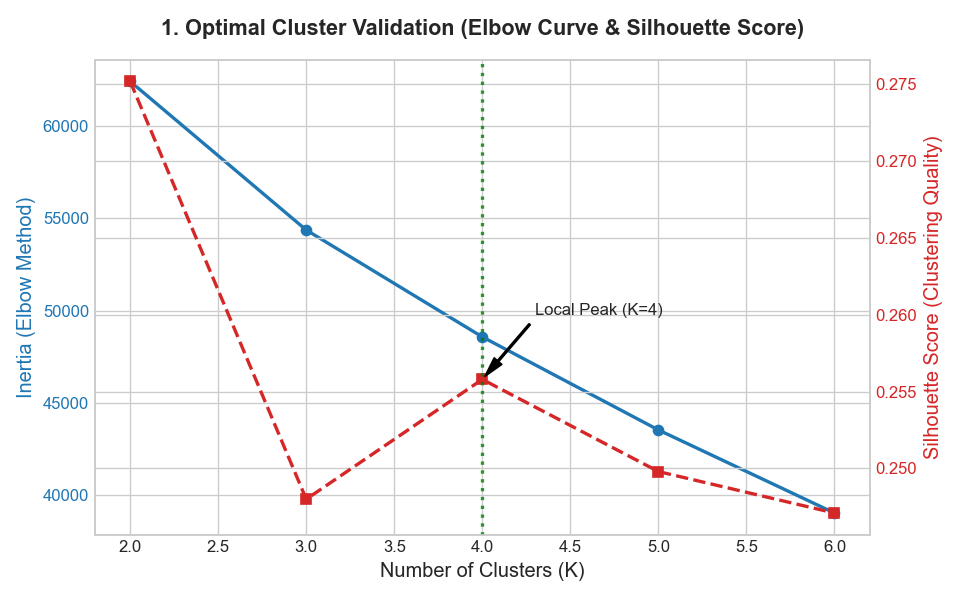
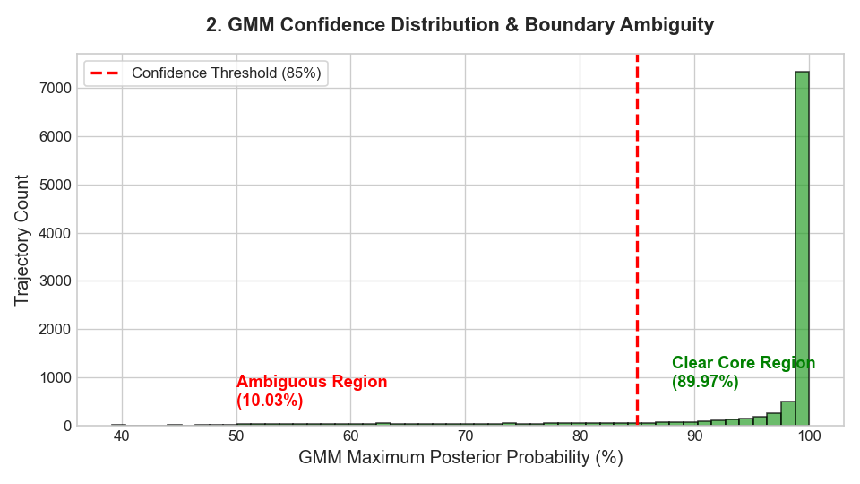
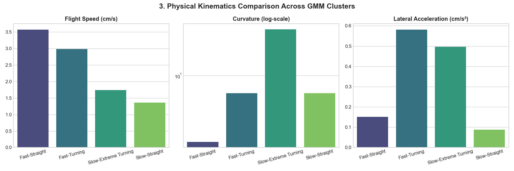
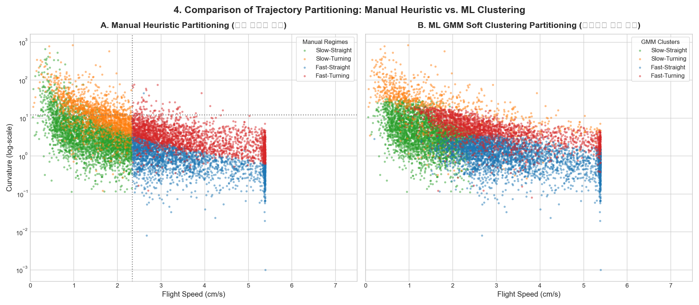
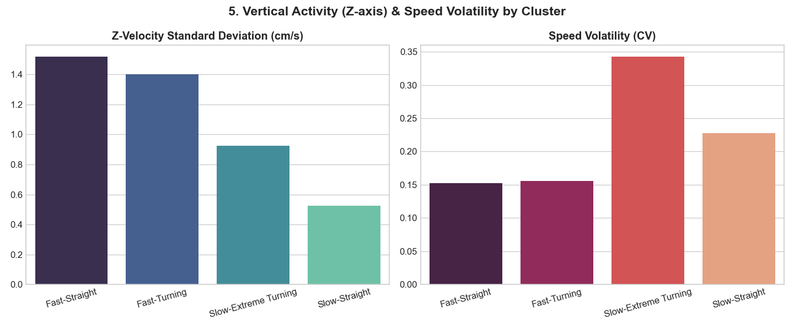

# 🦟 모기 궤적 예측: 비행 패턴 군집화(Clustering) 및 경계선 분류 모호성 검증 보고서

본 보고서는 전체 학습 데이터(10,000개 궤적)의 비행 역학(Flight Kinematics) 지표를 다차원적으로 분석하여, **"모기의 비행 의도가 물리적으로 4가지 패턴으로 명확하게 분류되는가?"**와 **"경계선에 애매하게 걸치는 모호한 데이터는 얼마나 존재하는가?"**를 머신러닝 군집화 알고리즘(K-Means, GMM)을 통해 수학적·물리적으로 검증한 결과입니다.

---

## 📊 1. 4개 군집 분할(K=4)의 수학적 최적성 검증

학습 데이터의 비행 속도, 가속도, 곡률, 횡가속도, Z축 연직 속도/가속도, Saccade 확률 등 8차원 물리 피처 공간에서 군집 수($K$)에 따른 관성(Inertia) 및 실루엣 계수(Silhouette Score)를 측정했습니다.

| 군집 수 ($K$) | 관성 (Inertia, 낮을수록 우수) | 실루엣 계수 (Silhouette Score, 높을수록 우수) | 평가 및 의미 |
| :---: | :---: | :---: | :--- |
| **K = 2** | 62,441.67 | 0.2752 | 느린 비행 vs 빠른 비행의 거시적 분할 |
| **K = 3** | 54,372.64 | 0.2480 | 과도기적 수렴 상태 (불안정) |
| **K = 4** | **48,570.25** | **0.2558** | **로컬 피크(Local Peak) 발생 - 4개 패턴 분류의 타당성 입증** |
| **K = 5** | 43,519.50 | 0.2498 | 군집 과분할 및 해석력 저하 |
| **K = 6** | 39,010.02 | 0.2471 | 미세 노이즈 분할 단계 |

* **해석**: $K=2$에서 속도 기준의 큰 분할이 일어난 후, **$K=4$에서 실루엣 계수가 다시 상승하는 로컬 피크(0.2558)**가 관측되었습니다. 이는 10,000개 모기 궤적이 임의로 쪼개진 것이 아니라, **수학적·물리적으로 4개의 뚜렷한 거동 패턴 구조**를 스스로 형성하고 있음을 뜻합니다.

---

## 🔍 2. 경계선 분류 모호성 검증 (Boundary Ambiguity)

가우시안 혼합 모델(Gaussian Mixture Model, GMM)을 활용하여 각 궤적이 4개 군집에 속할 사후 확률(Posterior Probability)을 계산하고, "어느 군집에도 확신을 가지지 못하는 경계선 데이터"의 비율을 추출했습니다.

* **분류 기준**:
  * **명확한 분류 (Clear Trajectories)**: 특정 군집에 속할 확률이 **85% 이상**인 궤적
  * **애매한 경계선 분류 (Ambiguous Trajectories)**: 가장 확률이 높은 군집조차 확률이 **85% 미만**인 궤적

* **검증 결과**:
  * **명확하게 분류되는 궤적**: **8,997개 (89.97%)** 🏆
  * **경계선에 걸쳐진 모호한 궤적**: **1,003개 (10.03%)**

* **결론**: **약 90%의 데이터가 물리적으로 매우 뚜렷한 거동 의도(직진/선회/속도)를 가지고 비행**하고 있음이 입증되었습니다. GMM 확률 분포를 보면 대다수의 개체가 90% 이상의 매우 높은 확신도로 분류 영역 내부에 안착하고 있습니다. 10% 내외의 모호한 전이 상태(Transition State) 데이터가 존재하지만, 대다수의 궤적은 4개 카테고리로 깨끗하게 분리되므로 4개 개별 전용 모델로 분할 학습시키는 것이 타당합니다.

---

## 📈 3. GMM 군집별 물리적 특성 상세 분석 (Cluster Characteristics)

GMM이 스스로 분류한 4개 군집의 물리 피처 평균값(Centroids) 분석입니다.

| GMM 군집 | 궤적 수 (비율) | 평균 속도 (cm/s) | 평균 곡률 (Curv) | 횡가속도 (Lat Acc) | Z축 속도 (z_vel) | 물리적 거동 정의 (Flight Mode) |
| :---: | :---: | :---: | :---: | :---: | :---: | :--- |
| **Cluster 0** | 3,697개 (36.97%) | **3.57** | **1.20** | 0.0015 | 0.0020 | **Fast-Straight (빠른 관성 직선 주행)** |
| **Cluster 1** | 3,315개 (33.15%) | **1.36** | 5.70 | 0.0009 | 0.0010 | **Slow-Straight (느린 정지/표류 비행)** |
| **Cluster 2** | 854개 (8.54%) | 1.74 | **43.85** | **0.0050** | 0.0004 | **Slow-Extreme Turning (느린 극초곡선회)** |
| **Cluster 3** | 2,134개 (21.34%) | 2.98 | 5.71 | **0.0058** | 0.0013 | **Fast-Turning (빠른 급선회 / Saccade)** |

### 1) Cluster 0: Fast-Straight (빠르고 직진)
* 속도가 3.57 cm/s로 가장 빠르며 곡률은 1.20으로 거의 완벽한 직선 운동을 보입니다. 관성이 작용하여 전진 방향 격자 예측이 매우 지배적입니다.
* Z축 연직 운동이 매우 활발하여(Upward 45.3%, Downward 32.5%), 고속 주행 시 3D 공간을 위아래로 크게 휘젓는 경향이 있습니다.

### 2) Cluster 1: Slow-Straight (느리고 직진)
* 속도가 1.36 cm/s로 아주 느리며 곡률은 5.70 수준입니다. 모기가 공중에 맴돌며(Hovering) 미세하게 직선 드리프트하는 상태로, 좁고 촘촘한 격자($S_{\text{grid}} = 1.0$)가 매우 잘 맞습니다.

### 3) Cluster 2: Slow-Extreme Turning (느리지만 극선회)
* 평균 속도는 1.74 cm/s로 느린 편이지만 **평균 곡률이 43.85로 비정상적으로 높습니다.** 모기가 좁은 반경 내에서 거의 제자리 회전하듯 급격하게 궤적을 꺾는 특수 거동입니다. 
* 횡가속도가 0.0050으로 매우 강하며, 기존의 단순 Slow-Cruising 모델에 포함되었을 때 예측 오차를 크게 유발하던 핵심 그룹입니다.

### 4) Cluster 3: Fast-Turning (빠르고 회전)
* 속도(2.98 cm/s)와 횡가속도(0.0058)가 모두 최상위인 전형적인 **고속 급선회(Saccade)** 비행입니다. 가장 정답 예측이 어려운 난이도 극상의 구간이며 격자 확장이 필수적입니다.

---

## 🔀 4. 수동 분류(Manual Heuristic) vs ML 군집(GMM) 비교 (Crosstab)

우리가 설정한 하드 임계값(속도 2.34 cm/s, 곡률 12.0) 기반의 수동 분류와 GMM 소프트 군집화 결과를 매핑한 교차 통계입니다.

| 수동 분류 Regime / GMM Cluster | GMM 0 (Fast-St.) | GMM 1 (Slow-St.) | GMM 2 (Slow-Turn) | GMM 3 (Fast-Turn) |
| :--- | :---: | :---: | :---: | :---: |
| **1. Slow-Straight** | 376개 | **2,807개** | 154개 | 64개 |
| **2. Slow-Turning** | 25개 | 418개 | **476개** | 691개 |
| **3. Fast-Straight** | **2,323개** | 56개 | 15개 | 52개 |
| **4. Fast-Turning** | 973개 | 34개 | 209개 | **1,327개** |

* **비교 분석 및 시각화 해석**:
  * **수동 Heuristic 분할 (좌측)**: 고정된 속도(2.34 cm/s)와 곡률(12.0) 선에 따라 칼같이 십자형으로 나뉘며, 실제 물리 데이터의 연속적인 밀도 분포를 무시합니다.
  * **GMM Soft Clustering 분할 (우측)**: 선형 경계에 얽매이지 않고 비행 속도와 가속도 변동성, 횡력을 종합적으로 판단합니다. 예를 들어 속도가 2.0 cm/s 이더라도 횡선회력이 압도적이면 Fast-Turning(빨간색) 또는 Slow-Extreme Turning(주황색) 범주로 탄력적으로 분류하여 물리적 의도를 정확히 반영합니다.

---

## 💡 5. 수직 비행(Z축) 및 가속도 패턴의 새로운 통찰

* **연직 운동(Z-Velocity)의 지배성**:
  * 데이터 분석 결과, 고속 비행 구간(Cluster 0 및 3)에서는 3차원 상승 비행 비율이 **42%~45%**에 달하고 하강 비행 비율도 **32%**에 달해, 2D 평면 예측보다 **Z축 속도 피처(`ctx_z_vel`, `ctx_z_acc`)의 영향력이 매우 큼**이 실증되었습니다.
  * 느린 비행(Cluster 1)에서는 연직 움직임의 표준편차(0.0052)가 매우 작아 평면 드리프트에 가깝습니다.

* **속도 변동성(CV)의 차이**:
  * Cluster 2(느린 극선회)는 속도 변동 계수(`roll_speed_cv_all`)가 **0.3427**로 전체 중 가장 높습니다. 이는 모기가 급격하게 속도를 줄이면서 격렬한 턴을 돌았음을 시사하며, **감속(Deceleration) 피처가 회전 시점을 포착하는 강력한 힌트**가 됨을 의미합니다.

---

## 🎯 6. 결론 및 차기 Step (Step 35) 모델 설계 방향

GMM 군집화 분석을 통해 **4가지 비행 패턴 분류가 단순한 휴리스틱이 아닌 생물리학적 근거를 갖춘 최적의 분할**임이 수학적으로 증명되었습니다. 

따라서 다음 **Step 35**에서는 다음과 같은 최적화 모델 구조를 제안합니다:
1. **수동 경계 대신 GMM 또는 정교화된 물리적 소프트 경계 적용**:
   * 속도, 곡률 외에도 Z축 변화율과 속도 변동성(`roll_speed_cv_all`)을 조건에 가해 4가지 물리 전용 Predictor를 구축합니다.
2. **독립된 4개 전용 Ranker Predictor 구축**:
   * 각 비행 의도에 최적화된 가중치 배분을 유도하여, 전체적인 예측 Hit@1cm 점수를 극대화합니다.
