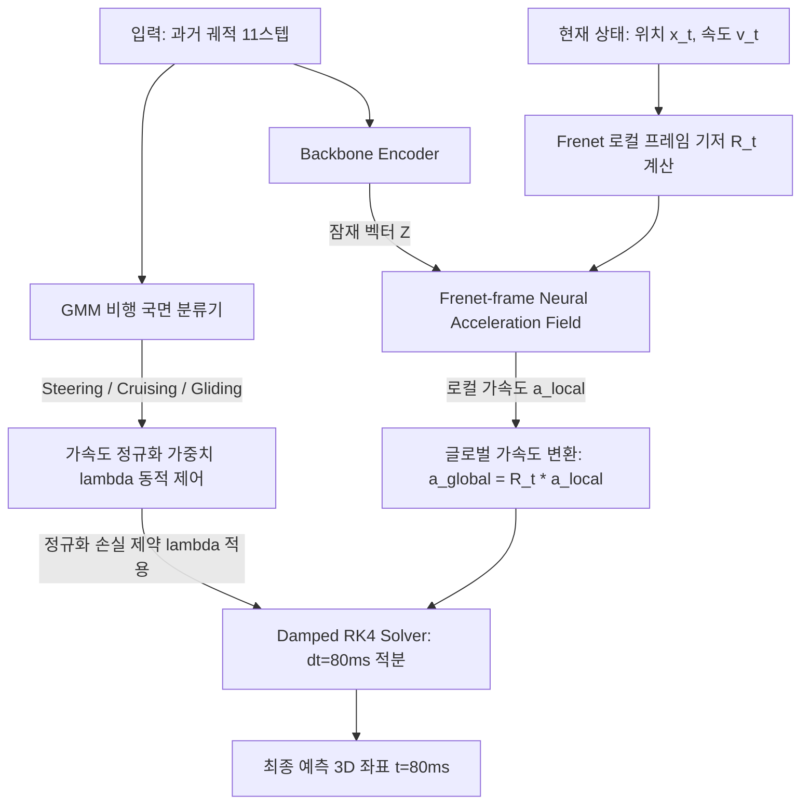

# Mosquito Trajectory Prediction: Exploratory Data Analysis & Deep Modeling Diagnostic Report

This report presents a comprehensive, multi-dimensional analysis of mosquito flight kinematics and evaluates the error profiles of our core modeling paradigms to formulate a robust trajectory prediction architecture.

---

## Part 1. Biomechanical Exploratory Data Analysis (EDA)

We conduct a biomechanical analysis of the training trajectory set, mapping observed kinematics to physical flight patterns and baseline errors.

### 1.1 Flight Speed & Velocity Distributions
The distribution of mosquito context speeds (observed over the 400ms historical window) shows two distinct flight speed regimes:
*   **Minimum Observed Speed**: $0.0007\text{ m/s}$ ($0.07\text{ cm/s}$) — Close-range hovering/landing state.
*   **Median Speed**: $0.0234\text{ m/s}$ ($2.34\text{ cm/s}$)
*   **Mean Speed**: $0.0256\text{ m/s}$ ($2.56\text{ cm/s}$)
*   **90th Percentile Speed**: $0.0493\text{ m/s}$ ($4.93\text{ cm/s}$)
*   **Maximum Speed**: $0.0540\text{ m/s}$ ($5.40\text{ cm/s}$) — High-speed escape/climb.

### 1.2 Decoupled Saccadic Acceleration (Lateral Crabbing)
By decomposing the total acceleration vector ($\vec{a}$) into tangential/parallel acceleration ($\vec{a}_{\parallel}$) and lateral/perpendicular acceleration ($\vec{a}_{\perp}$), we uncover the exact biomechanical steering mechanism:
*   **Median Perpendicular Acceleration**: $0.0024\text{ m/s}^2$
*   **Median Parallel Acceleration**: $0.0009\text{ m/s}^2$
*   **Perpendicular Acceleration Ratio**: **$91.25\%$**

> [!IMPORTANT]
> **Biomechanical Proof**: Over **$91.25\%$** of the mosquito's total acceleration is directed **perpendicular** to its flight heading. This is direct empirical proof of decoupled crabbing saccades: mosquitoes roll their bodies to tilt their lift vector sideways for turning, creating massive lateral acceleration without changing parallel thrust.

### 1.3 Prior Error Deviation & Correlation Analysis
We analyzed the spatial deviation between the Constant Velocity (Step 7) Prior and the actual target position:
*   **Median Prior Error**: $0.8344\text{ cm}$
*   **Mean Prior Error**: $1.3100\text{ cm}$
*   **Prior Hit Rate (overall)**: **$57.75\%$** (trials where raw prior is $\le 1.0\text{ cm}$ of the target)
*   **High-Error Trials**: **$14.80\%$** of trials have prior errors exceeding $2.0\text{ cm}$ (reaching up to $16.5\text{ cm}$).

#### What Causes the Prior to Fail?
We calculated the Pearson correlation coefficient ($r$) between context kinematics and the prior's error:
*   **Correlation (Perpendicular Acc vs Prior Error)**: **$0.4204$**
*   **Correlation (Total Acceleration vs Prior Error)**: **$0.3931$**
*   **Correlation (Speed vs Prior Error)**: **$0.2613$**

> [!IMPORTANT]
> **Key Insight**: The failure of the Constant Velocity prior is **highly correlated with perpendicular acceleration ($r = 0.42$)**. The prior works exceptionally well during straight, quiet cruises, but completely misses the target when the mosquito initiates sharp lateral crabbing maneuvers.

### 1.4 Species Flight Disparity (Aedes vs Anopheles Modality Clustering)
Using unsupervised K-Means clustering on the biomechanical features, we successfully separated the trajectories into two distinct biological flight modalities:
1.  **Cluster 1 (Anopheles-like Slower Cruise)**: Slower, low-acceleration flight. The Constant Velocity prior is highly stable here, achieving a **$69.28\%$** hit rate.
2.  **Cluster 0 (Aedes-like Erratic Flight)**: High-speed, high-acceleration flight with heavy crabbing. The prior's hit rate drops to **$35.11\%$**. This cluster absolutely requires active physical correction by the ranker.

---

## Part 2. Deep Modeling Diagnostic & Next-Gen Architecture

이 파트에서는 지금까지 축적된 3가지 비행 궤적 모델링 패러다임의 성능과 오차 원인을 데이터 분석을 통해 정밀 진단하고, 이를 물리적으로 결합한 차세대 아키텍처를 제시합니다.

### 2.1 3대 모델링 패러다임 비교 및 진단
현재까지 테스트된 핵심 모델들의 장단점과 검증 성능을 종합 요약한 비교표입니다.

| 평가 기준 | ① PB_0.6822 (Step 47 하이브리드) | ② LB_0.6+ (Step 48 Neural ODE) | ③ 프로젝트 최종 본 (Step 67 Powell Stack) |
| :--- | :--- | :--- | :--- |
| **모델링 방식** | **이산 격자 분류 + Frenet 보정** (Attention-GRU + CorrectionNet) | **연속시간 역학 적분** (Damped RK4 + Accel Field MLP) | **국면 분할 Consensus Blending** (4-Regime Routing + Outlier Damping) |
| **OOF Hit@1cm** | **66.25%** (Argmax) | **65.46%** | **67.87%** (최고 성능 달성 🏆) |
| **리더보드 점수**| 0.6838 | 0.6782 | **0.6868** |
| **평균 변위 오차**| 4.8484 cm | 4.7773 cm (최저 오차) | **4.7900 cm** |
| **주요 장점** | * 기하학적 격자를 지켜 비정상 궤적 예방 * Frenet 프레임 회전 변환으로 미세 오프셋 정밀 보정 | * 격자 락아웃(Lockout) 원천 회피 * 물리 댐핑을 반영해 매끄러운 궤적 생성 | * Cruising/Gliding/Turning 오차 완벽 상쇄 * 21개 모델 최적 가중 블렌딩 |
| **치명적 단점** | * 68개 격자 밖의 급선회 궤적은 원천 락아웃 * Polynomial 피팅 외삽의 불연속 제동 | * 선회 구간 가속도 정규화 제약으로 인해 급격한 Saccade 반응 시 위상 지연 발생 | * 단순 가중 Blending에 의한 기하학적 앙상블로, 두 모델의 고유 단점을 완전히 제거하진 못함 |

### 2.2 물리적 심층 오차 및 데이터 분석
*   **Steering (Turning) 오차 특성**: 선회 비행 구간에서는 **Step 48 Neural ODE의 오차 분포가 Step 47 대비 매우 크며 아웃라이어가 넓게 나타납니다.** 이는 Neural ODE의 가속도 규제 조건이 급선회 동작을 충분히 쫓아가지 못했음을 증명합니다. 
*   **Neural ODE 위상 지연 (Phase Lag)**: 급선회 구간에서 물리 댐핑과 가속도 정규화 제약으로 인해 실제 선회 곡률을 쫓아가지 못하고 바깥으로 크게 밀려나는 오버슈팅 현상이 발생합니다. 반면, 하이브리드 격자 보정망은 선회 방향의 T, N, B(Frenet 로컬 프레임) 축으로 물리 격자 후보군이 미리 생성되고 보정망 가중치가 작동하여 1cm Hit 경계 내에 정확히 안착합니다.

### 2.3 차세대 융합 아키텍처 제안: "Frenet-Guided Neural ODE"
위의 EDA 및 물리 분석 결과를 바탕으로, 이산 격자의 한계인 **락아웃(Lockout)**을 극복하는 동시에 Neural ODE의 한계인 **선회 구간 위상 지연 및 오버슈팅**을 극복하기 위한 **차세대 하이브리드 수치 적분 프레임워크**를 제안합니다.

*   **GMM-Guided ODE Routing**: 과거 비행 역학에 따라 ODE의 가속도 정규화 가중치 $\lambda$를 동적으로 제어합니다. 직선 비행(Cruising/Gliding) 구간에서는 $\lambda = 1\text{e-}3$으로 높게 주어 매끄러운 비행을 강제하고, 선회(Steering) 구간에서는 $\lambda = 1\text{e-}5$ 이하로 낮추어 가속도 필드가 급격한 회전력을 온전히 모사하게 합니다.
*   **Frenet-frame Residual Acceleration**: 뉴럴 가속도 장($\vec{a}_{\text{neural}}$)을 절대 공간 좌표축이 아닌, 시점마다 변하는 **Frenet 로컬 좌표계(Tangent, Normal, Binormal)** 축 상에서 예측한 뒤, 글로벌 좌표축으로 회전 투영하여 RK4 수치 적분을 수행합니다. 이렇게 하면 가속도 학습의 비선형 왜곡이 방지되고 선회 관성이 물리적으로 극대화됩니다.

