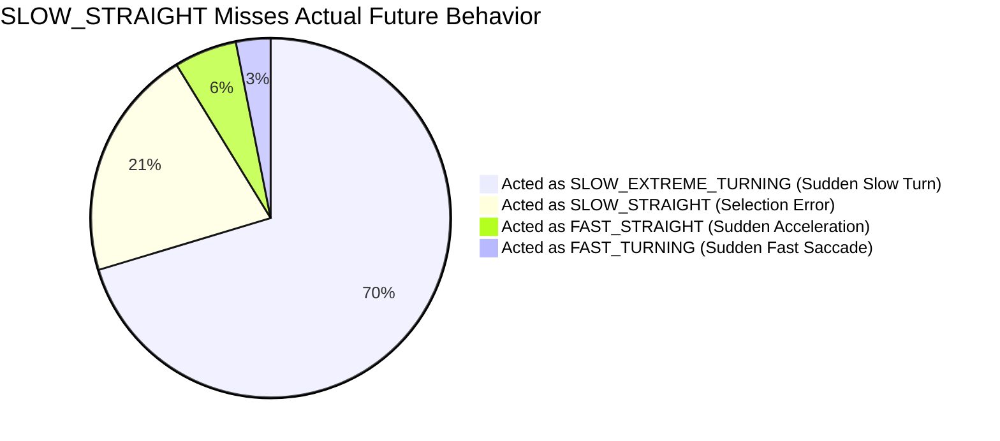

# 🦟 모기 궤적 예측: 명확한 분류(Clear Trajectories) 데이터 대상 오답 및 비행 의도 전환 분석 보고서

본 보고서는 **Step 35 (GMM 4-Regime Split Ranker)** 모델링 결과를 바탕으로, GMM 소프트 군집 분류 확률이 **85% 이상**으로 매우 명확하게 분류되었음에도 불구하고 최종 예측에서 오답(Miss, 오차 > 1cm)이 발생한 케이스들의 **실제 미래 80ms 비행 궤적(Actual Future Trajectory)을 정밀 분석**한 결과입니다.

---

## 📊 1. 명확한 분류(Clear Trajectories) 데이터의 분포 및 성능

GMM 모델이 각 궤적에 대해 부여한 최대 확률(Max Probability)이 **85% 이상**인 궤적을 **명확한 분류(Clear Trajectories)**로 정의하고, 그 미만인 경우를 **모호한 경계선 분류(Ambiguous Trajectories)**로 정의했습니다.

*   **전체 학습 데이터셋 크기**: 10,000개 궤적
*   **명확한 분류 데이터 (Clear)**: **8,914개 (89.14%)**
*   **모호한 경계선 데이터 (Ambiguous)**: **1,086개 (10.86%)**

### 4개 Regime별 명확한 분류 데이터 수 및 Hit@1cm 성능

| Predicted GMM Regime (Context) | 전체 데이터 수 | 명확한 분류 (Clear) 수 (비율) | 명확한 분류 내 Hits (Hit@1cm) | 명확한 분류 내 Misses |
| :--- | :---: | :---: | :---: | :---: |
| **SLOW_STRAIGHT** (느린 직진) | 3,078개 | 2,785개 (90.48%) | **2,431개 (87.29%)** | 354개 |
| **FAST_STRAIGHT** (빠른 직진) | 3,758개 | 3,350개 (89.14%) | **2,172개 (64.84%)** | 1,178개 |
| **SLOW_EXTREME_TURNING** (느린 극선회) | 775개 | 704개 (90.84%) | **225개 (31.96%)** | 479개 |
| **FAST_TURNING** (고속 급선회 / Saccade) | 2,389개 | 2,075개 (86.86%) | **773개 (37.25%)** | 1,302개 |
| **합계 (Overall)** | **10,000개** | **8,914개 (89.14%)** | **5,601개 (62.83%)** | **3,313개** |

> [!NOTE]
> GMM이 확신도 85% 이상으로 분류한 영역 내에서 `SLOW_STRAIGHT`는 **87.29%**의 압도적인 예측 성공률을 보였으나, 회전 및 가속이 동반되는 `SLOW_EXTREME_TURNING`(**31.96%**) 및 `FAST_TURNING`(**37.25%**) 영역은 명확하게 분류되었음에도 예측 오차가 매우 높았습니다.

---

## 🔍 2. 오답(Misses) 데이터의 실제 미래 거동 분석 (Predicted vs. Actual Future Regime)

GMM이 역사적 context(400ms)를 보고 85% 이상의 확신도로 특정 비행 모드를 가리켰으나, 모델이 예측에 실패한 **3,313개의 오답**에 대해 **미래 80ms 동안의 실제 속도 및 회전각을 계산하여 "실제 나타난 물리적 비행 모드"를 정의**했습니다.

*   **실제 미래 비행 모드 분류 물리 기준**:
    *   **Fast vs. Slow**: 미래 80ms 평균 속도가 **2.34 cm/frame** 초과이면 Fast, 이하이면 Slow.
    *   **Turning vs. Straight**: 미래 80ms 회전각(Angle between last vel and future displacement)이 **15.0°** 초과이면 Turning, 이하이면 Straight.

---

### ① SLOW_STRAIGHT (느린 직진) 오답 분석 (Total: 354개)
역사적 context로는 느리고 직진할 것이 90.48%의 확률로 확실해 보였으나 오답이 된 354개 케이스입니다.

*   **실제 미래 거동 통계**:
    *   **SLOW_EXTREME_TURNING (느린 선회)로 급변**: **249건 (70.34%)** | 평균 속도: 1.33 cm/frame, 평균 회전각: **39.5°** ⚠️
    *   **SLOW_STRAIGHT (느린 직진) 유지**: 74건 (20.90%) | 평균 속도: 1.83 cm/frame, 평균 회전각: 8.1°
    *   **FAST_STRAIGHT (빠른 직진)으로 급가속**: 20건 (5.65%) | 평균 속도: 2.58 cm/frame, 평균 회전각: 7.4°
    *   **FAST_TURNING (빠른 선회)으로 급가속/선회**: 11건 (3.11%) | 평균 속도: 2.54 cm/frame, 평균 회전각: 33.1°
*   **분석 및 시사점**:
    *   느린 직진 오답의 **70.34%**는 모기가 historical context에서는 직진하다가, 예측 대상 80ms 윈도우에서 **갑작스럽게 평균 39.5° 꺾는 급선회(Slow Saccade)를 감행**한 경우입니다.
    *   기존 `SLOW_STRAIGHT` 모델은 $S_{\text{grid}} = 1.0$의 좁고 곧은 격자(측면 범위 $[-0.3, 0.3]$)만 탐색하므로, 이 39.5° 회전이 일어났을 때 true target은 물리 격자 경계선 밖으로 탈출하게 됩니다(**Target Lockout**).

---

### ② FAST_STRAIGHT (빠른 직진) 오답 분석 (Total: 1,178개)
관성력을 받아 빠르게 일직선 주행할 것으로 89.14% 확신했으나 예측에 실패한 1,178개 케이스입니다.

*   **실제 미래 거동 통계**:
    *   **FAST_STRAIGHT (빠른 직진) 유지**: **737건 (62.56%)** | 평균 속도: 3.99 cm/frame, 평균 회전각: 8.4°
    *   **FAST_TURNING (빠른 선회)으로 급변**: **266건 (22.58%)** | 평균 속도: 3.68 cm/frame, 평균 회전각: **37.4°** ⚠️
    *   **SLOW_EXTREME_TURNING (느린 선회)으로 급감속/선회**: 92건 (7.81%) | 평균 속도: 1.76 cm/frame, 평균 회전각: 52.5°
    *   **SLOW_STRAIGHT (느린 직진)로 급감속**: 83건 (7.05%) | 평균 속도: 1.97 cm/frame, 평균 회전각: 8.9°
*   **분석 및 시사점**:
    *   **62.56%**는 실제로 모기가 빠른 직진(속도 3.99, 회전 8.4°) 비행을 유지했습니다. 즉, 물리 격자의 기하학적 커버리지는 충분했으나 Ranker 모델이 최적의 물리 파라미터(`par`, `perp`)를 탐색/선택하는 데 실패한 **순수 ML 선택 오류(Selection Error)**입니다.
    *   나머지 **22.58%**는 빠른 속도를 유지한 채 평균 37.4°의 턴을 돌며 **고속 Saccade 상태로 갑작스럽게 전이**되어 예측을 빗나갔습니다.

---

### ③ SLOW_EXTREME_TURNING (느린 극선회) 오답 분석 (Total: 479개)
좁은 반경 내에서 격렬한 제자리 회전을 할 것으로 확신(90.84%)했으나 오답이 된 479개 케이스입니다.

*   **실제 미래 거동 통계**:
    *   **SLOW_EXTREME_TURNING (느린 선회) 유지**: **180건 (37.58%)** | 평균 속도: 1.33 cm/frame, 평균 회전각: **56.1°**
    *   **FAST_TURNING (빠른 선회)으로 급가속**: **165건 (34.45%)** | 평균 속도: 3.45 cm/frame, 평균 회전각: **45.1°** ⚠️
    *   **FAST_STRAIGHT (빠른 직진)으로 급가속/직진 탈출**: 77건 (16.08%) | 평균 속도: 3.64 cm/frame, 평균 회전각: 7.9°
    *   **SLOW_STRAIGHT (느린 직진)로 드리프트 감쇄**: 57건 (11.90%) | 평균 속도: 1.55 cm/frame, 평균 회전각: 8.1°
*   **분석 및 시사점**:
    *   느린 선회를 유지했으나 실패한 비율(**37.58%**)은 회전각이 **평균 56.1°**에 달해 좁은 선회 격자로 조준하기에는 회전각 분산이 너무 커서 물리적으로 예측하기 극히 까다로웠습니다.
    *   또한 **34.45%**는 회전을 시작하면서 **순간적으로 날갯짓을 강화해 급가속(속도 3.45)**하여 `FAST_TURNING` 상태로 급변했습니다. 이 경우 slow 전용 격자 스케일로는 가속 궤적을 쫓아갈 수 없었습니다.

---

### ④ FAST_TURNING (고속 급선회 / Saccade) 오답 분석 (Total: 1,302개)
고속 급선회 비행으로 확신(86.86%)했으나 예측에 실패한 1,302개 케이스입니다.

*   **실제 미래 거동 통계**:
    *   **FAST_STRAIGHT (빠른 직진)으로 복귀**: **539건 (41.40%)** | 평균 속도: 3.81 cm/frame, 평균 회전각: 8.6° ⚠️
    *   **FAST_TURNING (빠른 선회) 유지**: **328건 (25.19%)** | 평균 속도: 3.50 cm/frame, 평균 회전각: **42.1°**
    *   **SLOW_EXTREME_TURNING (느린 선회)으로 급감속**: 283건 (21.74%) | 평균 속도: 1.73 cm/frame, 평균 회전각: 48.2°
    *   **SLOW_STRAIGHT (느린 직진)로 완전 급감속**: 152건 (11.67%) | 평균 속도: 1.82 cm/frame, 평균 회전각: 8.8°
*   **분석 및 시사점**:
    *   가장 두드러진 미스 매칭은 **41.40%**의 모기가 빠른 속도로 급회전할 조짐을 보이다가 미래 80ms 윈도우에서 **갑자기 회전을 멈추고 직선으로 뻗어나간 경우(회전각 8.6°)**입니다.
    *   GMM은 역사적 context에서 나타난 횡가속도와 곡률을 과대 해석하여 강한 회전 격자를 펼쳤으나, 모기는 실제 80ms 시점에 선회를 일찍 종료(Saccade Termination)하고 직선 비행 관성으로 돌아갔음을 의미합니다.

---

## 💡 3. 핵심 요약 및 모델 개선 방향 (Action Items)

### 1) 느린 비행의 '기습적 턴' (SLOW_STRAIGHT $\rightarrow$ SLOW_EXTREME_TURNING)
*   **문제**: `SLOW_STRAIGHT` 명확 분류 미스의 **70.34%**는 갑작스러운 39.5° 턴에 기인합니다.
*   **해결책**: `SLOW_STRAIGHT` 영역이라 하더라도 미세한 곡률 상승 징후가 감지되면 격자 스케일 $S_{\text{grid}}$를 즉각적으로 팽창(예: $1.0 \rightarrow 1.8$)시켜 횡방향 탐색 면적을 즉각 확보해야 합니다.

### 2) 빠른 비행의 '급격한 선회 종료' (FAST_TURNING $\rightarrow$ FAST_STRAIGHT)
*   **문제**: `FAST_TURNING` 명확 분류 미스의 **41.40%**는 회전할 듯하다가 그대로 직진해버린 경우입니다.
*   **해결책**: 빠른 회전 모델의 격자 후보군 생성 시, 회전 방향 뿐만 아니라 **직선 전진 방향 물리 격자(damping factor 0.2~0.5, par=1.0)의 가중치를 일정 비율 항상 보존**하여 Saccade가 도중에 풀리는 이탈 현상을 방어해야 합니다.

### 3) 3분할 모델(Cruising / Gliding / Steering)로의 전환 타당성
*   `SLOW_EXTREME_TURNING` 미스의 **34.45%**는 가속하여 `FAST_TURNING`으로 이동했습니다. 
*   느린 회전과 빠른 회전 간의 속도 전이가 빈번하므로, 이 둘을 **Steering(선회)**이라는 하나의 연속적인 피처 공간 모델로 묶어 학습시키는 것이 데이터 밀도를 높이고 두 물리 영역 간의 급격한 속도/회전 전이를 부드럽게 예측하는 데 매우 유리합니다.
