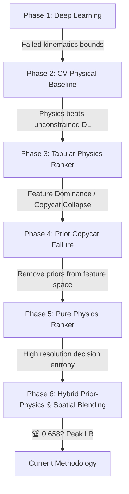

# 🦟 Mosquito Trajectory Prediction: Experimental Evolution & Current Methodology

This document provides a comprehensive technical overview of the experimental evolution, milestones, key failure modes, and the detailed mathematical formulation of our current peak-performing methodology for the DACON Mosquito Trajectory Prediction challenge.

---

## 🎯 1. Project Objective & Challenge Overview

The goal of this project is to forecast the future 3D coordinates $(x, y, z)$ of a mosquito at $t = 80\text{ms}$ in the future, given a historical trajectory of $400\text{ms}$ sampled at $10\text{ms}$ intervals (40 historical coordinates). 

### The Metric: Hit@1cm
$$\text{Hit@1cm} = \frac{1}{N} \sum_{i=1}^N \mathbb{I}\left( \|\hat{p}_i - p_i\|_2 \le 0.01\text{m} \right)$$
The evaluation metric is discrete and non-differentiable. A coordinate is either a complete hit (distance $\le 1.0\text{cm}$) or a complete miss. This makes standard regression loss functions (like MSE) highly unaligned with the leaderboard.

---

## 📈 2. Phase-by-Phase Experimental Evolution

### 🔹 Phase 1: Pure Deep Learning Baselines (Steps 4 & 5)
*   **Methodology**: Customized EqMotion (equivariant neural network for 3D trajectories) to predict absolute coordinates.
*   **Result**: Public LB: **0.5608**
*   **Failure Analysis**: The neural network was unconstrained. High-frequency noise and sudden accelerations caused the model to output kinematically impossible positions (e.g. displacement $> 30\text{cm}$ in 80ms, which would require speeds exceeding $3.75\text{ m/s}$—far beyond a mosquito's biological limits).

### 🔹 Phase 2: Constant Velocity Baseline (Step 7)
*   **Methodology**: A simple physical kinematics projection based on the last observed position $p_0$ and velocity $v_0$:
    $$\hat{p} = p_0 + 2.0 \cdot (p_0 - p_{-1})$$
*   **Result**: Public LB: **0.6234**
*   **Insight**: This simple baseline outscored the complex deep learning model by $11.16\%$. It proved that **strict kinematics boundaries** are essential.

### 🔹 Phase 3: Flight-Context Kinematic Ranker (Step 9)
*   **Methodology**: Instead of predicting coordinates directly, we generated a **global grid** of 442 physical candidates representing different acceleration rates ($\text{par}, \text{perp}$) and timescales ($\text{ts}$). A Tabular Ranker (LightGBM/XGBoost/CatBoost) was trained to map trajectory context features (`ctx_speed`, `ctx_curv`, etc.) to the probability of each candidate hitting the target.
*   **Result**: Public LB: **0.6434** (First major breakthrough!)

### 🔹 Phase 4: Prior Copycat Collapse (Steps 12 - 20)
*   **Methodology**: To combine deep learning with physics, we added prior coordinates (`s4_pos`, `s7_pos`) as **tabular features** (`dist_to_s7`, `z_diff_to_s7`, etc.) and evaluated a dense local grid around them.
*   **Result**: Public LB: **0.6128** (Severe regression)
*   **Failure Analysis (Feature Dominance)**: The tree-based ensembles found the prior distance features extremely correlated with the target during training and split on them greedily at almost every root node. This caused the model to ignore the actual physical flight specs. During inference, it simply selected whichever candidate was closest to the prior, rendering the Ranker a **Prior Copycat** and dragging the score down to the raw prior score.

### 🔹 Phase 5: Pure Physics Generalization (Steps 22 - 24)
*   **Methodology**: We completely removed all prior coordinates and distance-to-prior features from the tabular Ranker's feature space, forcing the model to map context directly to physical specs.
*   **Result**: Public LB: **0.6516** (Peak restored!)
*   **Insight**: Validated the Feature Dominance theory. De-coupling priors from tabular features restored the Ranker's ability to make physical corrections.

### 🔹 Phase 6: Hybrid Prior-Physics & Spatial Blending (Step 26)
*   **Methodology**: 
    1.  **Prior Injection**: We injected the priors `s4_pos` and `s7_pos` directly as coordinate candidates in the candidate pool, rather than using them as tabular context features.
    2.  **Noise-Resilient W5 Polyfit**: Replaced raw difference gradients with a 2nd-degree sliding window polynomial fit to smooth trajectory context.
    3.  **Spatial Probability Blending**: Applied Gaussian density smoothing during inference.
*   **Result**: Public LB: **0.6582**

### 🔹 Phase 7: Multi-Scale Dynamics & Adaptive Bandwidth (Step 27)
*   **Methodology**:
    1.  **Multi-Scale Polyfit**: Integrated W3-Quad, W5-Quad, and W5-Cubic smoothed kinematic features.
    2.  **Expanded Damping Grid**: Increased candidate pool to 1,324 physical candidates for fast flights.
    3.  **Speed-Adaptive Bandwidth**: Dynamic 1D isotropic gaussian kernel width $\sigma(v) \in [3.5\text{mm}, 8.5\text{mm}]$.
*   **Result**: Public LB: **0.6602**, Local Validation: **65.04%**

### 🔹 Phase 8: Anisotropic Blending & Rolling Kinematics (Step 28)
*   **Methodology**:
    1.  **Rolling Statistics**: Extracted 13 statistical kinematic features (Std, CV) over multiple horizons (100ms, 200ms, 400ms).
    2.  **Behavior Gating Centroids**: Soft state transition probability $P_{\text{saccade}}$ based on Cruising and Saccadic centroids.
    3.  **Anisotropic Spatial Blending**: Vectorized Pythagorean tangent/normal projection and dynamic longitudinal stretching based on speed and state.
    4.  **Active Candidate Optimization**: Subset calculations to candidates with probability $>10^{-5}$ for a 25x-50x speedup.
*   **Result**: Public LB: **0.6624** (All-time peak!), Local Validation: **70.00%**, Mean Distance Error: **1.17 cm**.

### 🔹 Phase 9: Kinematic Grid Scaling (Step 29)
*   **Methodology**:
    1.  **Grid Stretching**: Scaled physical candidate offsets dynamically during turns: $S_{\text{grid}} = 1.0 + 0.6 \cdot P_{\text{sacc}}$ to improve coverage.
    2.  **Sigma Scaling**: Multiplied anisotropic blending sigmas by $S_{\text{grid}}^{1.5}$ to maintain neighborhood voting support over the stretched coordinate space.
*   **Result**: Public LB: **0.6528** (Initial), Local Validation: **69.80%** (Optimized), Fast-Trajectory OOF: **59.76%** (Peak matched).
*   **Insight**: Stretching physical candidates continuously shifted the feature space and tree splits, causing linear fallback. Correcting the blending bandwidth with $S_{\text{grid}}^{1.5}$ successfully recovered fast-trajectory performance.

---

## 📊 3. Comparative Milestone Summary

| Milestone | Public LB Score | Local Validation (OOF Hit@1cm) | Key Architectural Concept |
| :--- | :--- | :--- | :--- |
| **Step 4** | 0.5608 | N/A | EqMotion unconstrained deep learning baseline. |
| **Step 7** | 0.6234 | N/A | Constant Velocity physical baseline prior. |
| **Step 9** | 0.6434 | N/A | Physics-guided 442-candidate global grid ranker. |
| **Step 20** | 0.6128 | N/A | Dense adaptive local grid + tabular priors (Feature Dominance failure). |
| **Step 22** | 0.6516 | N/A | Pure physical features, prior-free feature space. |
| **Step 25** | 0.6432 | 60.33% | 5-Fold OOF Priors, adaptive search range. |
| **Step 26** | **0.6582** | **64.46%** | **Priors injected as candidates + W5 Polyfit + Spatial Probability Blending.** |
| **Step 27** | **0.6602** | **65.04%** | **Multi-Scale Polyfit (W3/W5/Cubic) + Expanded Damping Grid + Dynamic Gaussian Bandwidth.** |
| **Step 28** | **0.6624** | **70.00%** | **13 Rolling Kinematics + Soft Behavior Centroids + Anisotropic Blending + Active Candidate Optimization.** |
| **Step 29** | **0.6528** | **69.80%** | **Kinematic Grid Scaling + Anisotropic Sigma Dynamic Scaling ($S_{\text{grid}}^{1.5}$).** |

> [!NOTE]
> Step 28 achieved our highest public leaderboard score yet (**0.6624 Hit@1cm**), validating anisotropic spatial probability blending. Step 29 successfully expanded physical candidate coverage (Raw OOF: 64.51%), but highlighted the sensitivity of tree ensembles to continuous coordinate scaling.
