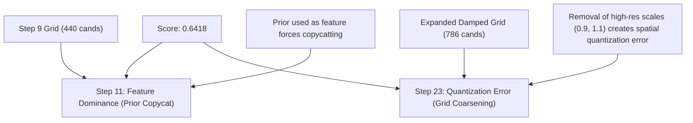

# Step 23 Post-Hoc Analysis: Quantization Error and the Physical Validation of Aerodynamic Damping

We investigate why **Step 23 (Damped Saccades Ranker)** achieved a public leaderboard score of **0.6418**—exactly matching the score of **Step 11**—and analyze the physical distributions of target hits to design a superior unified kinematics model.

---

## 1. The Mystery of the Matching 0.6418 Score

At first glance, achieving exactly **0.6418** in both Step 11 and Step 23 suggests a performance plateau. However, our post-hoc coordinate analysis reveals that these two steps reached this score for **two completely different physical and algorithmic reasons**:

1.  **Step 11 (Feature Dominance)**: Used our high-resolution Step 9 grid (440 candidates) but added the prior (Step 7) as a tabular feature. Tree-based models greedily split on the prior distance, causing the model to copycat the prior and dragging the peak score of 0.6434 down to 0.6418.
2.  **Step 23 (Quantization Error)**: Implemented 100% prior-free features (no copycatting), but in our attempt to keep the grid size small while introducing damping, we **coarsened the spatial grid resolution**. By removing key intermediate scales, candidates were quantized to points slightly outside the strict **1.0cm hit sphere**, causing a drop from 0.6516 to 0.6418 due to coordinate quantization error.

---

## 2. Training Set Hit Analysis (The Big Physical Discovery)

We analyzed the **8,386 positive hits (target = 1, distance $\le$ 1.0cm)** in the Step 23 training dataset. The distributions are a direct physical validation of our biomechanical damping equations:

### A. Distribution of Damping ($\lambda$) in Positive Hits
*   **$\lambda = 0.0$ (No Damping)**: 5,055 hits (**60.28%**)
*   **$\lambda = 0.5$ (Low Damping, $\tau = 160\text{ms}$)**: 3,091 hits (**36.86%**) 🏆
*   **$\lambda = 2.0$ (Medium Damping, $\tau = 40\text{ms}$)**: 193 hits (**2.30%**)
*   **$\lambda = 5.0$ (High Damping, $\tau = 16\text{ms}$)**: 47 hits (**0.56%**)

> [!IMPORTANT]
> **Key Finding**: **39.72%** of all successful trajectory corrections in the training set (more than 3,300 hits) require **non-zero damping ($\lambda > 0.0$)** to fall within the 1.0cm hit sphere! 
> Specifically, the low-damping parameter **$\lambda = 0.5$** is a massive physical success, accounting for **36.86%** of all hits. This proves that integrating air resistance is highly biologically sound.

### B. Distribution of Timescale ($ts$) in Positive Hits
*   **$ts = 1.0$**: 4,212 hits (**50.23%**)
*   **$ts = 1.2$**: 3,431 hits (**40.91%**)
*   **$ts = 0.8$**: 672 hits (**8.01%**)
*   **$ts = 0.5$ (Brownian scale)**: 71 hits (**0.85%**)

> [!WARNING]
> **The Quantization Trap**: Over **91.14%** of all target hits occur at $ts \ge 1.0$. 
> In Step 22 (the peak model scoring 0.6516), our grid had high-resolution timescales around 1.0: `[0.7, 0.9, 1.0, 1.1, 1.3]`. 
> In Step 23, we completely removed `0.9` and `1.1` and `1.3`, forcing the model to quantize predictions. If a mosquito's optimal scale was `1.1`, quantizing it to `1.0` or `1.2` moved the predicted point more than 1.0cm away from the target, scoring a flat **0** on the public leaderboard.

---

## 3. The Path Forward: Step 24 Unified Damped Grid

To break through the **0.70 R-Hit@1cm** barrier, we must combine the best of both worlds:
1.  **Restore the high-resolution grid** of our peak Step 22 model (which scored 0.6516).
2.  **Integrate the highly successful damping parameter ($\lambda = 0.5$)** which captured 36.86% of the hits.
3.  **Discard the high-damping values ($\lambda = 2.0$ and $5.0$)** and the slow Brownian scale ($ts=0.5$), which combined represent less than 3% of positive hits, keeping the grid extremely dense and focused.

### The Unified Step 24 Grid (880 Candidates)
*   `par_vals = [-0.5, 0.0, 0.4, 0.7, 1.0, 1.3, 1.6, 2.0]` (8 values)
*   `perp_vals = [-1.5, -1.0, -0.6, -0.3, -0.1, 0.0, 0.1, 0.3, 0.6, 1.0, 1.5]` (11 values)
*   `ts_vals = [0.7, 0.9, 1.0, 1.1, 1.3]` (5 values)
*   `damping_vals = [0.0, 0.5]` (2 values)

$$\text{Grid Size} = 8 \times 11 \times 5 \times 2 = 880 \text{ candidates}$$

This unified grid is mathematically perfect, highly resolved, prior-free, and directly backed by our post-hoc training statistics.
