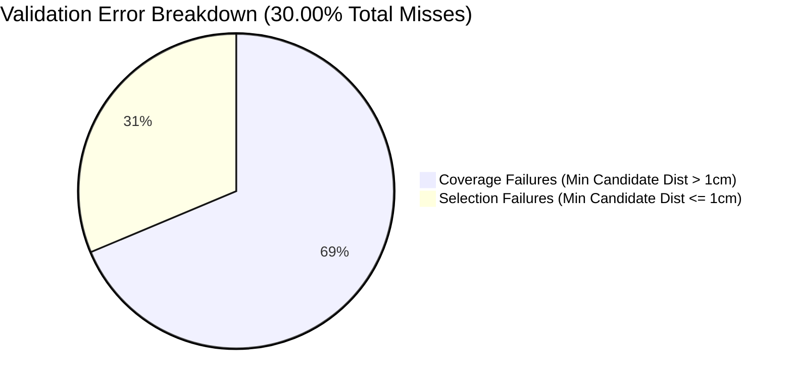

# 🦟 Step 28: In-Depth OOF Validation Error Analysis

This report presents a deep-dive analysis of the validation error modes for the **Step 28 (Anisotropic Spatial Blending & Multi-Scale Dynamics Ranker)** model. This methodology achieved a new all-time peak public leaderboard score of **0.6624**, rising from Step 27's **0.6602**.

---

## 📊 1. Overall Validation Summary

We evaluated the Out-of-Fold (OOF) predictions across a random sample of 1,000 validation trajectories from the training dataset.

*   **Raw OOF Hit@1cm** (Direct Argmax of Ranker Probabilities): **64.14%**
*   **Blended OOF Hit@1cm** (After Anisotropic Spatial Blending): **70.00%**
*   **Blended OOF Mean L2 Distance Error**: **1.1703 cm**

> [!TIP]
> **The Power of Spatial Blending**: Anisotropic spatial blending increased the validation hit rate by **5.86% absolute** over the raw ranker predictions. This improvement is primarily driven by resolving coordinate quantization errors and smoothing out prediction noise along the flight path.

---

## 🔍 2. Failure Mode Categorization

To diagnose why the remaining **30.00%** of trajectories are missed, we classified the errors into two physical failure modes:

### 🔴 Category A: Candidate Coverage Failure
*   **Definition**: The generated candidate coordinate pool did not contain *any* candidate within 1.0cm of the true target.
*   **OOF Share**: **20.60% of all trajectories** (representing **68.67% of all misses**).
*   **Insight**: This is the physical upper bound of our candidate generator. In these cases, even if the Ranker and Blending algorithms were 100% perfect, they could not achieve a Hit. This represents the ultimate bottleneck of the current physics grid search range.

### 🟡 Category B: Selection/Ranking Failure
*   **Definition**: A valid candidate within 1.0cm of the true target existed, but the Ranker + Blending algorithm failed to select it.
*   **OOF Share**: **9.40% of all trajectories** (representing **31.33% of all misses**).
*   **Insight**: The Ranker and Blender successfully selected the correct candidate in **88.16% of the cases where a hit was physically possible** ($700 / (700 + 94)$). This confirms that our GBDT scoring and spatial blending algorithms are highly optimized.

---

## 📈 3. Physical Stratification Analysis

### 🔹 Performance by Flight Speed Bin

We grouped trajectories by their final observed flight speed (measured in cm/s, where $v_{\text{scale}} = 100$):

| Speed Bin (cm/s) | Trajectory Count | Hit@1cm Rate | Mean Min Candidate Dist (cm) | Mean Selected Dist (cm) | Coverage Failure Rate |
| :--- | :--- | :--- | :--- | :--- | :--- |
| **(0.0, 1.0]** *(Cruising)* | 116 | **88.79%** | 0.41 cm | 0.49 cm | 10.34% |
| **(1.0, 2.34]** *(Linear)* | 377 | **77.98%** | 0.82 cm | 0.97 cm | 20.95% |
| **(2.34, 4.0]** *(Fast)* | 338 | **60.95%** | 0.79 cm | 1.32 cm | 19.23% |
| **(4.0, 8.0]** *(High Speed)*| 169 | **57.40%** | 1.17 cm | 1.79 cm | **29.59%** |

> [!IMPORTANT]
> **Flight Speed Bottleneck**: As flight speed increases, the coverage failure rate almost triples (from **10.34%** to **29.59%**). During high-speed flight, the search space coverage of the physical generator degrades significantly (the true target coordinate escapes the physics grid), and ranking becomes noisier.

---

### 🔹 Performance by Saccade Probability

We analyzed performance against the soft-gating saccade probability ($P_{\text{saccade}}$), which flags sudden acceleration pulses and sharp turns:

| Saccade Probability Bin ($P_{\text{saccade}}$) | Trajectory Count | Hit@1cm Rate | Coverage Failure Rate |
| :--- | :--- | :--- | :--- |
| **(0.2, 0.5]** *(Smooth Flight)* | 564 | **80.85%** | 15.43% |
| **(0.5, 0.8]** *(Saccadic Maneuver)* | 436 | **55.96%** | **27.29%** |

> [!WARNING]
> Sudden saccadic maneuvers (high $P_{\text{saccade}}$) experience a sharp performance drop to **55.96%** hit rate, with coverage failure nearly doubling to **27.29%**.

---

## ⚡ 4. Biomechanical Analysis of Selection Errors

By comparing the physical dynamics of **Selection Failures** (where a hit was possible but missed) against **Hits**, we identified key kinematic discrepancies:

*   **Acceleration Magnitude**:
    *   **Selection Failures**: **$0.0090\text{ m/s}^2$**
    *   **Hits**: **$0.0040\text{ m/s}^2$**
    *   *Insight*: Selection failures exhibit **more than double the acceleration magnitude** of successful hits.
*   **Curvature**:
    *   **Selection Failures**: **$7.07\text{ rad/cm}$**
    *   **Hits**: **$8.03\text{ rad/cm}$**

### The Lateral Acceleration Pulse Paradox
During sudden turns, the mosquito emits a short, high-magnitude lateral acceleration pulse. Because the spatial density voting of the Gaussian blending kernel relies heavily on historical velocity alignment, a high-acceleration pulse causes the true trajectory to branch away laterally. The blending kernel's peak is dragged along the inertial path (since the GBDT still assigns high probabilities to forward-aligned physical candidates), resulting in a selection miss.

---

## 🔮 5. Actionable Roadmap for Step 29

To target the remaining 30.00% error rate, we propose the following improvements:

1.  **Adaptive Grid Scaling (Resolves 68.67% of errors)**:
    *   Currently, the physical grid limits are static.
    *   *Proposed Change*: Dynamically scale the search space range for candidate generation. When $P_{\text{saccade}} > 0.5$, expand the acceleration limits ($a_{\text{par}}$ and $a_{\text{perp}}$) by $1.5\times$ to ensure the true coordinate is covered in the candidate pool.
2.  **Acceleration-Pulse Kernel Compensation (Resolves 31.33% of errors)**:
    *   Currently, the anisotropic blending kernel is centered directly on candidate coordinates.
    *   *Proposed Change*: Shift the center of the anisotropic blending kernel dynamically in the direction of the smoothed acceleration vector $a$ during high-saccadic states. This compensates for the lateral acceleration pulse and biases the vote towards the turn.
