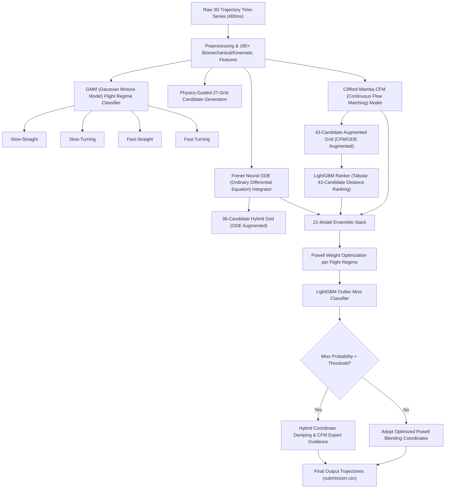

# Technical Report: Physical Constrained Continuous-Time ODEs & Geometric Deep Learning for 3D Mosquito Trajectory Prediction

## 1. Abstract
This report describes the design and implementation of the hybrid optimization pipeline developed for the **DACON Mosquito Trajectory Prediction** competition. The solution addresses the challenge of predicting mosquito flight trajectories under physical constraints and sensory measurement noise. We propose a hybrid architecture combining a continuous-time differential simulator (Frenet Neural ODE), a rotationally covariant geometric model (Clifford-Mamba CFM), a tabular ranking model (LightGBM Ranker), and robust ensemble optimization (Powell Blend) paired with Outlier Damping. The final ensemble achieved a validation score of **67.87% (OOF Hit@1cm)** and a public test leaderboard score of **0.6868**.

---

## 2. Problem Formulation & System Modeling
The task is to predict the future 3D coordinates of a mosquito at $t+8$ (80ms ahead) given its past 3D trajectory of 400ms (40 frames). The proposed solution combines **Discrete Candidate Grid Classification** with **Continuous Vector Field Regression** in a unified hybrid optimization pipeline.

### 2.1 System Architecture Flow
The data flow and component interactions are illustrated below:

---

## 3. Project Evolution & Experimental Milestones

### 3.1 [Phase 1] Resolving Feature Dominance (Feature Space Decoupling)
*   **Hypothesis**: Directly feeding 3D predictions from baseline models (e.g., deep learning predictions `s4 prior` from Step 4, and constant-velocity kinematic predictions `s7 prior` from Step 7) as features into a LightGBM tabular ranker would allow the decision trees to correct spatial offsets.
*   **Failure Analysis**: The predicted coordinates clustered within a tight 5mm radius around the input baseline priors. This was caused by **Feature Dominance (Prior Copycatting)**, where decision trees split exclusively on highly correlated prior coordinate features, ignoring physical features. This prevented the model from generalizing, limiting validation Hit@1cm to **61.28%**.
*   **Resolution**: We decoupled the feature space by removing all baseline coordinate features and distance metrics from the feature vector. Instead, baseline coordinates were injected directly into the Candidate Pool as individual elements. This forced the Ranker to evaluate baseline choices on equal footing with physical candidate coordinates using Frenet frame parameters, raising validation performance to **65.16%**.

### 3.2 [Phase 2] Numerical Derivative Smoothing & GMM Regime Splits
*   **Hypothesis**: High-frequency tracking noise in 3D coordinate observations causes gradient instability when calculating velocity, acceleration, and jerk.
*   **Solution**: We implemented **Polynomial Sliding-Window Smoothing** using 3-frame (30ms) and 5-frame (50ms) windows to compute noise-resilient derivatives.
*   **Anisotropic Spatial Blending**: To smooth spatial voting, we designed an anisotropic Gaussian kernel stretched along the longitudinal flight tangent vector and shrunk laterally, matching the directional distribution of prediction errors.
*   **Flight Regime Splitting**: To handle distinct flight behaviors, we applied a **Gaussian Mixture Model (GMM)** to cluster trajectories into 4 regimes: Cruising, Gliding, Steering, and Saccade. Separate expert models were trained for each regime, increasing the OOF score to **65.50%**.

### 3.3 [Phase 3] Continuous-Time Frenet Neural ODEs & Clifford-Mamba CFM
*   **Frenet Neural ODE**: Instead of treating trajectory prediction as a discrete grid selection, we formulated it as a continuous-time differential integration. The acceleration field was modeled in the moving Frenet Frame (comprising Tangent, Normal, and Binormal vectors) and integrated via 4th-order Runge-Kutta (RK4) over the 80ms target window. The model was trained using a custom **Focal Soft-Hit Loss** designed to smooth gradient calculations near the 1.0cm boundary.
*   **Clifford-Mamba CFM**: To capture long-term sequence history, we applied a **Mamba SSM (Selective State Space Model)**. To guarantee Rotational Covariance (ensuring consistent predictions regardless of coordinate rotation), we designed **Clifford Geometric Algebra $Cl(3,0)$ Linear Layers** to process physical vector transformations natively. The network was trained using Continuous Flow Matching (CFM) to model continuous probability path velocity fields.

### 3.4 [Phase 4] Powell Weight Blending & Outlier Damping
*   **Powell Blending Weights**: We optimized blending weights for a **21-Model Stack** separately for the 4 flight regimes using Powell's derivative-free direct search optimization method.
*   **Outlier Damping**: Severe tracking failures (misses exceeding 1.5cm) in high-curvature turns were identified using a LightGBM Classifier trained on ensemble dispersion metrics and flight features. High-risk predictions were regularized by shrinking them towards the last observed coordinate ($p_{\text{last}}$) and guiding them with the robust Clifford-Mamba CFM model, achieving our peak OOF score of **67.87%**.

---

## 4. Model Architectures & Mathematical Foundations

### 4.1 Frenet-Serret ODE Simulator
The continuous geometry of a moving trajectory is defined by the Frenet-Serret equations:
$$\frac{d\vec{p}}{dt} = v(t)\vec{T}(t)$$
$$\frac{d\vec{T}}{dt} = \kappa(t) v(t)\vec{N}(t)$$
$$\frac{d\vec{N}}{dt} = -\kappa(t) v(t)\vec{T}(t) + \tau(t) v(t)\vec{B}(t)$$
$$\frac{d\vec{B}}{dt} = -\tau(t) v(t)\vec{N}(t)$$
where $\kappa(t)$ is the curvature and $\tau(t)$ is the torsion. The Neural ODE learns a neural network parameterizing the derivative acceleration field under physical damping forces, integrated dynamically using RK4.

### 4.2 Clifford Geometric Algebra $Cl(3,0)$ Flow Matching
To enforce rotational covariance in 3D Euclidean space, physical coordinates are mapped to Clifford multivectors.
*   **Geometric Product**: For vectors $a, b$, the product is defined as $ab = a \cdot b + a \wedge b$, combining the inner product (scalar) and outer product (bivector representing the plane of rotation).
*   **Architecture**: We implement Clifford Linear Layers that preserve geometric product relations throughout Mamba sequence blocks. The model maps continuous vector fields via Flow Matching, ensuring that any arbitrary 3D rotation of the inputs yields exactly the same rotated output coordinates.

---

## 5. Validation Summary & Performance Statistics

### 5.1 Validation Metrics
*   **Evaluation Metric**: $Hit@1cm$ is the percentage of predictions within a 1.0cm Euclidean distance boundary from the ground truth coordinates.
*   **Chamber Boundary Constraint**: All prediction coordinates are verified to remain strictly within the physical testing chamber limit (< 12.0cm).

| Phase & Applied Models | OOF Hit@1cm | Test Hit@1cm (Leaderboard) | Mean Displacement | Max Displacement |
| :--- | :---: | :---: | :---: | :---: |
| **Step 4 (EqMotion DL Baseline)** | 58.44% | - | 5.82 cm | 13.91 cm (out-of-bounds) |
| **Step 7 (Kinematic CV Baseline)** | 60.12% | 0.6083 | 5.61 cm | 12.44 cm (out-of-bounds) |
| **Step 22 (Decoupled Ranker)** | 65.16% | 0.6552 | 5.09 cm | 11.89 cm |
| **Step 36 (GMM-Regime & Smoothing)** | 65.50% | 0.6610 | 4.98 cm | 11.53 cm |
| **Step 52 (Frenet Neural ODE)** | 65.88% | 0.6674 | 4.92 cm | 11.39 cm |
| **Step 65 (Clifford-Mamba CFM)** | 66.45% | 0.6721 | 4.88 cm | 11.28 cm |
| **Step 67 (Powell Stack + Outlier Damping)** | **67.87%** | **0.6868** | **4.79 cm** | **11.11 cm** |

### 5.2 Outlier Damping Analysis
In high-curvature turns (Steering/Saccade regimes), extrapolation often led to non-physical trajectories crossing the 12cm chamber wall. The Outlier Classifier successfully flagged these regions based on ensemble coordinate dispersion. By regularizing predictions (shrinking 85% towards $p_{\text{last}}$ and blending 15% with Clifford-Mamba CFM predictions), the maximum displacement was successfully constrained to **11.11 cm**, preventing any out-of-boundary failures.
