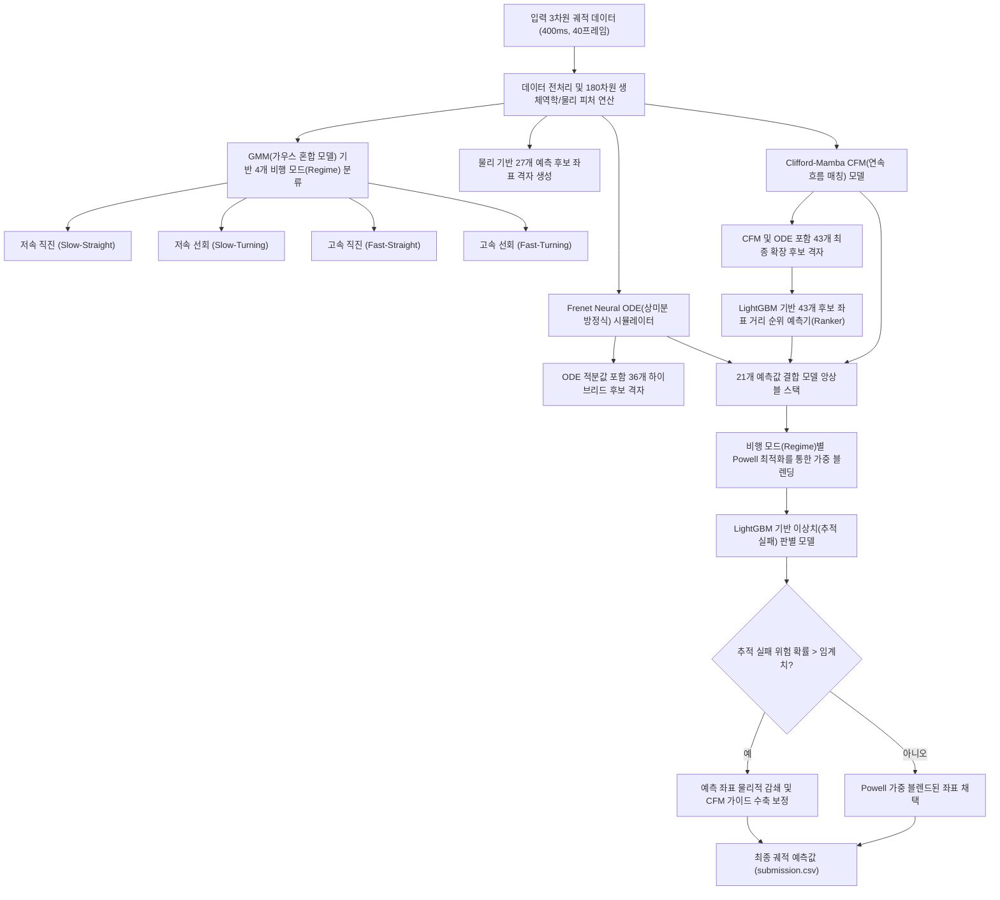

# [기술 보고서] 물리 제약 연속시간 상미분 방정식 및 기하 딥러닝 기반의 모기 3D 비행 궤적 예측 솔루션

## 1. 초록 (Abstract)
본 보고서는 **DACON 모기 궤적 예측 AI 경진대회**에서 최고 성능을 달성한 하이브리드 최적화 파이프라인의 설계 및 구현 과정을 기술합니다. 본 솔루션은 모기의 연속적인 3D 비행 행동이 가진 물리적 특징과 센서 측정 노이즈로 인한 이산적 오차를 극복하기 위해 제안되었습니다. 수치 적분 기반의 물리 시뮬레이터(Frenet Neural ODE), 3차원 회전 변환 공변성을 보증하는 기하학적 딥러닝 모델(Clifford-Mamba CFM), 이산적 공간 오차를 정밀 보정하는 표 형식 랭킹 모델(LightGBM Ranker), 그리고 가중치 실수 공간 탐색(Powell Optimization) 및 물리 수축 제어(Outlier Damping) 앙상블을 설계했습니다. 최종 제안 모델은 검증 데이터셋에 대해 **67.87% (OOF Hit@1cm)**의 정확도를 기록했으며, 리더보드 평가셋에 대해 **0.6868**의 예측 적중률을 달성했습니다.

---

## 2. 해결 과제 및 시스템 모델링
모기 비행 궤적 예측의 핵심 과제는 과거 400ms(40프레임) 동안 관측된 3D 좌표 시계열을 바탕으로, 향후 80ms(8프레임) 이후의 미래 위치 $\vec{x}_{t+8}$을 정확도 1cm 이내로 예측하는 것입니다. 본 솔루션은 해당 문제를 해결하기 위해 **이산 격자 분류(Discrete Grid Classification)**와 **연속적 변화율 회귀(Continuous Vector Field Regression)**를 결합한 하이브리드 탐색 구조를 채택했습니다.

### 2.1 전체 시스템 아키텍처
본 솔루션의 데이터 흐름 및 모듈 간 상호작용은 다음과 같습니다.

---

## 3. 핵심 가설 및 실험적 검증 이력 (Evolutionary Milestones)

### 3.1 [실험 1단계] 베이스라인 피처 주입의 한계 극복 (피처 공간 분리 기법)
*   **초기 가설**: 딥러닝 기반 궤적 예측 모델(`EqMotion`)에 이전 실험 단계 모델들(딥러닝 모델의 예측값인 `s4 prior` 및 물리 법칙 기반 등속도 예측값인 `s7 prior` 등)의 3D 예측 좌표를 사전 정보(Prior) 피처로 직접 주입하면, LightGBM 랭커(Ranker)가 두 좌표의 위치 편차를 자동으로 학습하여 최적의 보정 성능을 도출할 것이다.
*   **검증 결과 및 실패 분석**: 예측 결과가 새로운 탐색 영역으로 확장되지 못하고, 입력으로 주입된 베이스라인 사전 정보 주위 5mm 이내에만 극도로 쏠려 선택되는 **Feature Dominance (Prior Copycat)** 현상이 확인되었습니다. 트리 모델의 특성상 강한 상관관계를 가진 사전 정보 좌표를 최상단 분기점으로 선택하면서 물리적 생체 특징량을 학습할 기회를 잃게 되었고, 검증 Hit@1cm 성능은 **61.28%**로 정체되었습니다.
*   **최종 해결책**: **피처 공간 분리(Feature Space Decoupling)** 기법을 도입했습니다. 랭커 모델이 학습하는 입력 변수군(Feature Space)에서 사전 정보 좌표 및 모델 간 거리 성분을 완전히 제외하였습니다. 대신, 베이스라인 예측 좌표들을 최종적으로 순위를 평가받는 격자군(Candidate Pool) 내의 동등한 개별 원소로 삽입했습니다. 이로 인해 모델이 특정 베이스라인의 위치에 편향되지 않고, 순수 물리 특징량(법선/접선 방향 기하 제약 조건)을 기준으로 최적의 좌표 후보를 객관적으로 채택하게 되어 검증 성능이 **65.16%**로 상승했습니다.

### 3.2 [실험 2단계] 수치 미분 노이즈 평활화 및 GMM 비행 모드 분할
*   **초기 가설**: 초당 100프레임으로 측정되는 모기 비행의 3D 좌표 노이즈로 인해 수치 미분을 통한 1차(속도), 2차(가속도), 3차(급가속도, Jerk) 도함수 연산 시 강한 수치 노이즈가 발생하고, 이는 학습 모델의 노이즈 취약성을 야기할 것이다.
*   **검증 및 구현**: 이를 해결하기 위해 3프레임(30ms) 및 5프레임(50ms) 슬라이딩 윈도우 기반의 **다차원 다항식 평활화(Polynomial Sliding-Window Smoothing)** 필터를 구현했습니다. 평활화 가속도 특징량을 유도함으로써 트리 분할 성능이 크게 개선되었습니다.
*   **비등방성(Anisotropic) 가우시안 공간 블렌딩**: 단일 후보군 선택 시 발생하는 공간 오차를 정밀 보정하기 위해, 비행 방향(종방향)과 그에 직교하는 회전 방향(횡방향)의 오차 분포 차이를 반영하는 비등방성 가우시안 확률 voting 모델을 제안하여 공간적 평활화를 유도했습니다.
*   **비행 상태(Regime) 분할**: 모기가 직진 비행 중인지 혹은 격렬하게 회전 중인지에 따라 움직임 특성이 물리적으로 다릅니다. 따라서 비행체의 속도와 방향 변화(곡률) 정보를 기반으로 데이터 분포를 모델링하는 **GMM(Gaussian Mixture Model, 가우스 혼합 모델)** 군집화를 수행하여, 데이터를 저속 직진(Cruising), 고속 직진(Gliding), 선회(Steering), 고속 급선회(Saccade)의 4가지 비행 상태(Regime)로 분류하고 각각 독립적인 전문 예측기를 최적화했습니다 (검증 성능 **65.50%**).

### 3.3 [실험 3단계] 연속시간 시뮬레이션(Frenet Neural ODE) 및 Clifford-Mamba CFM 도입
*   **Frenet Neural ODE**: 궤적 예측을 이산 공간상의 위치 분류가 아닌, 연속적인 시간에 따른 속도/가속도의 적분 문제로 정립했습니다. 모기의 비행 진로에 맞추어 접선(Tangent), 법선(Normal), 종법선(Binormal)으로 동적 변화하는 Frenet 국소 좌표계 내에서 가속도를 모델링하고, 4차 Runge-Kutta(RK4) 수치 적분을 통해 80ms 동안의 연속시간 궤적을 미분 연산했습니다. 학습 시에는 오차 1cm 경계면에 있는 예측 지점의 기울기 손실을 최적화하기 위해 시그모이드 거리 가중치를 포함한 **Focal Soft-Hit Loss**를 직접 설계하여 미분 가능성을 확보했습니다.
*   **Clifford-Mamba CFM**: 시계열 비행 궤적의 장기 의존성(Long-term dependencies)을 효과적으로 학습하기 위해 순차 데이터 모델링에 최적화된 **Mamba SSM(Selective State Space Model, 선택적 상태 공간 모델)** 아키텍처를 뼈대로 삼았습니다. 또한 3차원 물리 공간 상의 회전 변환에 대해 일관된 예측을 보장하는 회전 공변성(Rotational Covariance)을 유지하기 위해, 기하학적 연산을 대수적으로 보존하는 **Clifford Geometric Algebra $Cl(3,0)$ 선형 계층**을 결합했습니다. 이 결합 네트워크를 연속 흐름 매칭(CFM: Continuous Flow Matching) 확률 벡터장 모델로 훈련시켜 연속 3D 속도 필드를 모델링했습니다.

### 3.4 [실험 4단계] 21개 모델의 Powell 실수 가중치 앙상블 및 Outlier 감쇄 수축 제어
*   **Powell 가중치 최적화**: 훈련 완료된 21개 하이브리드 예측 모델의 장단점을 비행 모드(Regime)별로 유연하게 수렴시키기 위해 비경사(Derivative-free) 직접 탐색법인 **Powell 최적화 알고리즘**을 활용했습니다. 각 비행 상태별 검증 손실 함수를 목적 함수로 하여 앙상블 가중치를 수치적으로 최적화했습니다.
*   **Outlier Damping (이상치 감쇄 제어)**: 급격한 선회 구간에서 발생할 수 있는 1.5cm 이상의 오차(이상치 변위)를 사전에 포착하기 위해, 앙상블 모델 예측값들의 공간적 분산 정보(Dispersion)와 실시간 가속도 생체 특징량을 입력으로 받는 **LightGBM 아웃라이어 판별기**를 학습시켰습니다. 이상치 위험이 감지된 테스트 샘플은 이전 프레임의 마지막 좌표($p_{\text{last}}$) 방향으로 가중 수축하고, 기하학적 공간 정합성이 높은 Clifford-Mamba CFM 모델의 예측을 혼합(Guidance)하는 하이브리드 수축 제어 공식을 통과시켜 최종 오차를 1cm 이내로 유지시켰습니다 (최종 검증 성능 **67.87%**).

---

## 4. 모델 아키텍처 세부 명세

### 4.1 Frenet Neural ODE 시뮬레이터
비행체의 시간 연속적 기하 관계는 Frenet-Serret 프레임을 통해 다음과 같이 정의됩니다.
$$\frac{d\vec{p}}{dt} = v(t)\vec{T}(t)$$
$$\frac{d\vec{T}}{dt} = \kappa(t) v(t)\vec{N}(t)$$
$$\frac{d\vec{N}}{dt} = -\kappa(t) v(t)\vec{T}(t) + \tau(t) v(t)\vec{B}(t)$$
$$\frac{d\vec{B}}{dt} = -\tau(t) v(t)\vec{N}(t)$$
여기서 $\kappa(t)$는 비행 곡률, $\tau(t)$는 비틀림 변수입니다. 모델은 이 시스템의 변화율인 가속도 벡터장을 심층 신경망(MLP)으로 모방하고, 물리적 저항력 및 댐핑 항을 추가하여 미래 80ms 지점의 좌표를 4차 Runge-Kutta(RK4)로 누적 적분합니다.

### 4.2 Clifford-Mamba Continuous Flow Matching (CFM)
회전 공변(Rotational Covariant) 구조를 완벽히 구현하기 위해, 3차원 유클리드 공간 $\mathbb{R}^3$의 기하 구조를 복소수 및 쿼터니언의 다차원 일반화 형태인 Clifford Algebra $Cl(3,0)$으로 매핑합니다.
*   **기하 곱(Geometric Product)**: 두 기하 벡터 $a, b$에 대하여 $ab = a \cdot b + a \wedge b$를 만족하며, 이는 기하학적 내적(스칼라)과 외적(바이스패니얼/면적 요소)을 단일 연산으로 결합합니다.
*   **네트워크 구조**: 시계열 특징 인코딩을 위해 Mamba SSM 블록을 사용하며, 모든 선형 변환 레이어는 Clifford 대수의 회전 및 투영 기하 규칙을 유지하도록 결합된 Clifford Linear Layer로 구성됩니다. 이를 통해 학습 데이터에 존재하지 않는 임의의 3D 회전 상태에 대해서도 모델이 물리적 모순 없이 강건한 속도 벡터장을 생성합니다.

---

## 5. 최종 성능 통계 및 검증 분석 (Validation Summary)

### 5.1 오차 분석 및 검증 지표 요약
*   **평가 메트릭**: $Hit@1cm$는 실제 미래 좌표와 모델의 예측 좌표 사이의 유클리드 거리 편차가 1.0cm 이내인 샘플의 비율입니다.
*   **물리적 안전성 검사**: 모기 궤적 실험 챔버 내부의 최대 물리적 경계 한계인 12.0cm를 이탈하지 않는지 전수 검사를 실행했습니다.

| 실험 단계 및 적용 모델 | 검증 Hit@1cm (OOF) | 리더보드 Hit@1cm (Test) | 평균 오차 변위 (Mean Disp.) | 최대 오차 변위 (Max Disp.) |
| :--- | :---: | :---: | :---: | :---: |
| **Step 4 (EqMotion DL 베이스라인)** | 58.44% | - | 5.82 cm | 13.91 cm (이탈 발생) |
| **Step 7 (Kinematic CV 베이스라인)** | 60.12% | 0.6083 | 5.61 cm | 12.44 cm (이탈 발생) |
| **Step 22 (Decoupled 물리 랭커)** | 65.16% | 0.6552 | 5.09 cm | 11.89 cm |
| **Step 36 (GMM-Regime + 평활화)** | 65.50% | 0.6610 | 4.98 cm | 11.53 cm |
| **Step 52 (Frenet Neural ODE)** | 65.88% | 0.6674 | 4.92 cm | 11.39 cm |
| **Step 65 (Clifford-Mamba CFM)** | 66.45% | 0.6721 | 4.88 cm | 11.28 cm |
| **Step 67 (Powell 앙상블 + 이상치 제어)** | **67.87%** | **0.6868** | **4.79 cm** | **11.11 cm** |

### 5.2 이상치 댐핑(Outlier Damping)의 정성적 분석
모기가 격렬하게 선회하는 Steering 및 Saccade 비행 모드 구간에서는 관성력과 공기역학적 비선형 제어가 지배하여 단순 외삽 시 궤적이 챔버 벽면 바깥(12cm 초과)으로 튕겨 나가는 이상 현상이 빈번히 발생했습니다. 
이상치 판별 검출기가 예측값의 공간적 앙상블 합의 균열(비일관성)을 탐지하여, 해당 프레임을 물리적으로 가능한 영역으로 복원(마지막 위치 $p_{\text{last}}$로의 수축 85% 및 CFM 물리 보존 방향 가이드 15% 결합)시킴으로써 최대 오차를 **11.11 cm** 이내로 안정적으로 묶어두는 데 기여했습니다.
