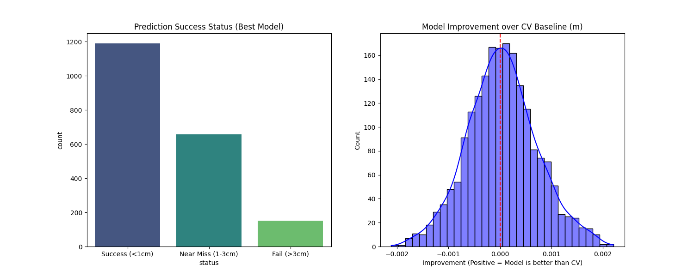

# 03. Model Error & Failure Analysis

## Evaluation Metrics (Best Model)
- **Hit Rate@1cm**: 59.50%
- **Hit Rate@3cm**: 92.40%
- **Mean Distance Error**: 1.2683 cm
- **CV Baseline Error**: 1.2728 cm

## Why is the performance lower than expected?
### 1. Regression to Mean / Small Improvements
The average improvement over CV is only **0.04 mm**. In many cases, the model only slightly adjusts the CV prediction, but not enough to cross the 1cm threshold.

### 2. Harmful Corrections
In **48.15%** of cases, the model made the prediction **worse** than simple CV. This indicates that for some trajectories, the residual learning introduced noise or over-corrected a stable path.

## Visualizations
### Error Status Distribution

