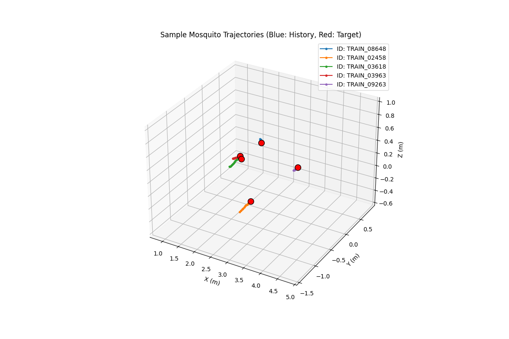
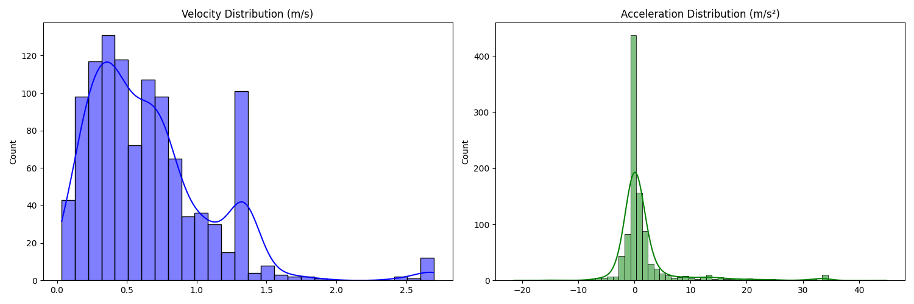

# 01. Preliminary Physics Analysis

## Physics Statistics (100 samples)
- **Avg Velocity**: 0.6548
- **Max Velocity**: 2.6975
- **95th Pctl Velocity**: 1.3480
- **Avg Accel**: 1.6497
- **Max Accel**: 44.8617

## Visualizations
### 3D Trajectories

### Physics Distributions

