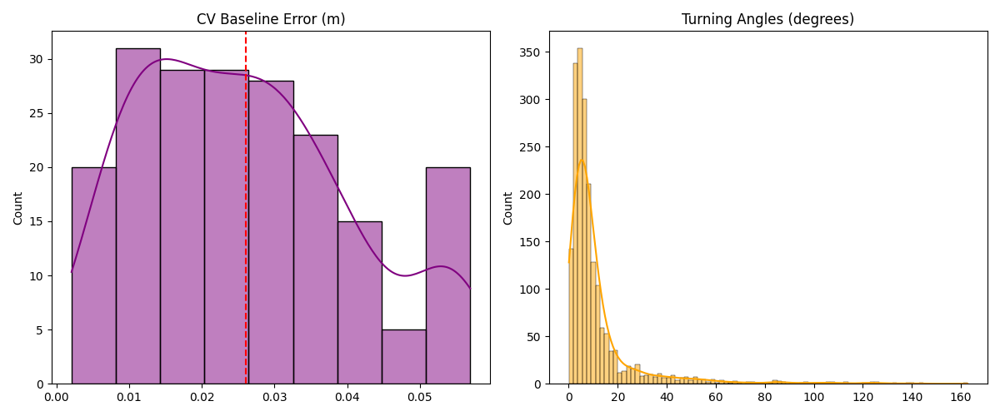

# 02. Advanced Maneuverability & Baseline Analysis

### 1. CV Baseline Performance
- **Average CV Error**: 0.0260 m
- **R-Hit@1cm Potential**: 14.50%

### 2. Maneuverability Analysis
- **Average Turning Angle**: 11.61°
- **90th Percentile Angle**: 25.15°

### 3. Visualizations

